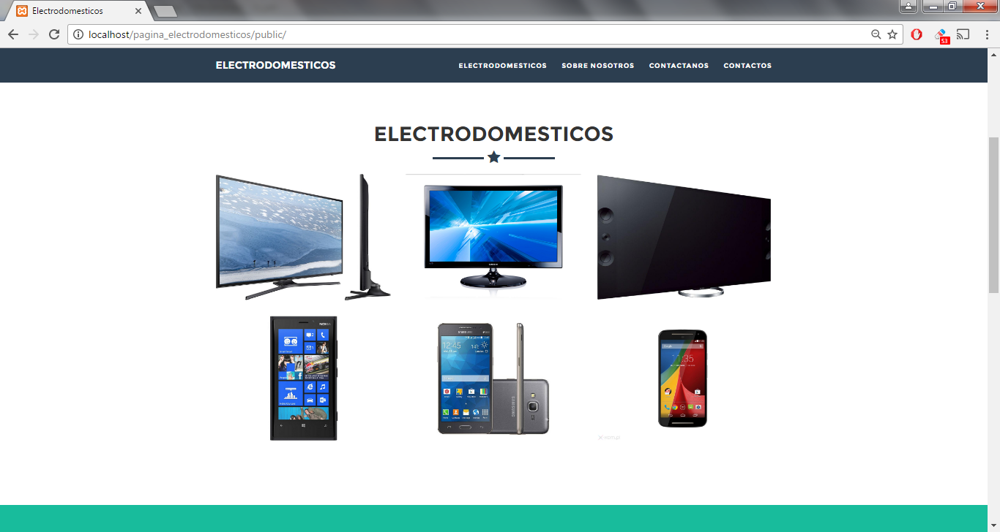
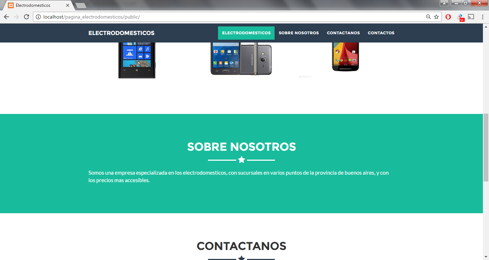
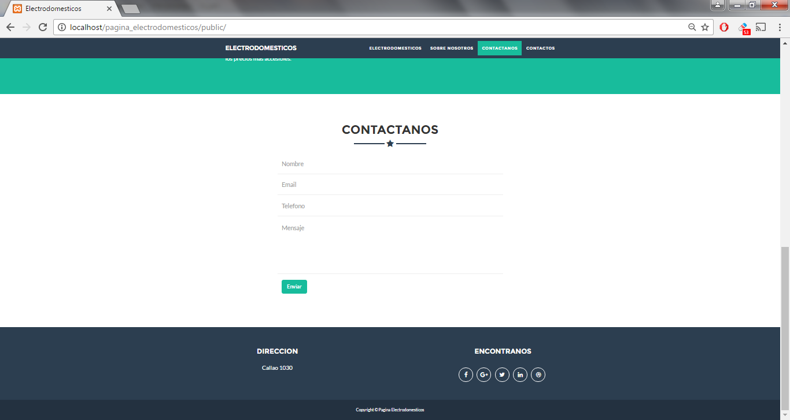
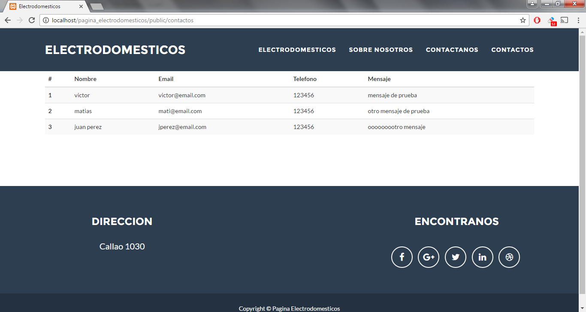

1. Ahora vamos a crear la base de datos, yendo a la siguiente página [http://localhost/phpmyadmin/](http://localhost/phpmyadmin/), donde vamos a hacer lo siguiente:
   1. Presionamos el botón de la casita, y a la derecha de la pantalla va a aparecer un menú, del cual elegimos la opción Cuentas de Usuario, una vez en esa pantalla, vamos hasta abajo, donde aparece un link que dice Agregar cuenta de usuario, entramos ahí, y hacemos lo siguiente:
      1. Nombre de usuario: electrodomesticos
      2. Nombre de host: localhost,
      3. Contraseña: ptf
      4. Donde dice Base de datos para la cuenta de usuario, seleccionar opción Crear base de datos con el mismo nombre y otorgar todos los privilegios.
      5. Luego vamos hasta abajo, donde dice Privilegios globales, y seleccionamos la opción Seleccionar todo
      6. Finalmente guardamos con el botón Continuar.
   2. Presionando sobre el botón de la izquierda de la pantalla “Nueva”, vamos a crear  la base de datos, que vamos a ponerle de nombre empresa_electrodomesticos, y presionar el botón crear
2. Una vez creada la base de datos, hay que ejecutar el siguiente comando en la consola: php artisan migrate, el cual creara automáticamente las tablas que vamos a usar.
3. Una vez creadas las tablas, hay que ejecutar el siguiente comando en la consola: php artisan db:seed. Este comando, lo que hará, será agregar los datos que vamos a usar en la base de datos. Los Seeders, son usados para crear datos en las tablas que tenemos, para poder hacer pruebas, o insertar datos por default.
4. Una vez instalado todo, podemos entrar a nuestro proyecto desde el navegador, a través de la siguiente URL: [http://localhost/pagina_electrodomesticos/public/](http://localhost/pagina_electrodomesticos/public/), donde vamos a ver nuestra página home, y poder navegar a las demás páginas, como la de contactos.
5. Imagenes de la aplicacion levantada:

